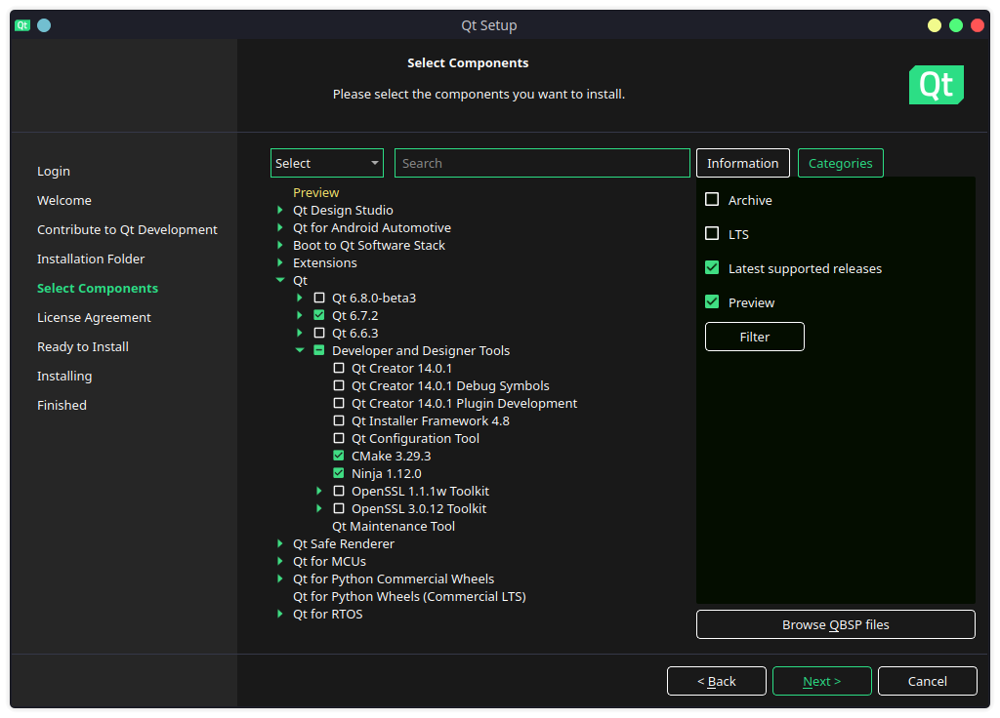

<!-- TOC -->

- [Install Required Packages](#install-required-packages)
- [Install Qt 6.7.2](#install-qt-672)
- [Update PATH and Environment Variables](#update-path-and-environment-variables)
- [Create the Installation Directory](#create-the-installation-directory)
- [Setup kde-builder](#setup-kde-builder)
- [Build KDE](#build-kde)
    - [Explained](#explained)
    - [Optional Modules](#optional-modules)
    - [Final Command](#final-command)
- [Troubleshooting](#troubleshooting)
    - [Identify the build failure](#identify-the-build-failure)
    - [Note the CMake Errors](#note-the-cmake-errors)
    - [Find Missing Packages](#find-missing-packages)
    - [Resume Building](#resume-building)
    - [Ungoof](#ungoof)
    - [Unable to find stylesheets](#unable-to-find-stylesheets)
- [Start KDE 6](#start-kde-6)

<!-- /TOC -->


### Install Required Packages

- Install necessary build dependencies:

  ```bash
  sudo apt update
  sudo apt install cmake extra-cmake-modules git build-essential libsecret-1-dev libxapian-dev qtkeychain-qt6-dev libqt6keychain1 libsasl2-dev kirigami2-dev xcb libxcb-xinput-dev libxcb-dri3-dev libdisplay-info-dev
  ```

### Install Qt 6.7.2

1. **Remove Existing Qt Installation** (If Needed):
   - If you need to remove an old Qt installation, run:
     ```bash
     sudo rm -rf /opt/qt
     ```
   - **Heads up**: This command will delete everything in `/opt/qt`. Make sure that directory is ready to be erased!

2. **Install Qt**:
   - Download Qt using the [Qt Online Installer](https://www.qt.io/download-qt-installer) and install it to `/opt/qt`.

   - **Custom Installation**:
     - **Qt 6.7.2**
     - **CMake 3.29.3**
     - **Ninja 1.12.0**



### Update PATH and Environment Variables

- Add this to your `~/.bashrc` (or `~/.zshrc`), replacing `<qt-version>` with your version:

  ```bash
  echo 'export QT6DIR=/opt/qt/<qt-version>/gcc_64' >> ~/.bashrc
  echo 'export QT_SELECT=default' >> ~/.bashrc
  echo 'export QTTOOLDIR=$QT6DIR/bin' >> ~/.bashrc
  echo 'export QTLIBDIR=$QT6DIR/lib' >> ~/.bashrc
  echo 'export PATH=$QTTOOLDIR:$PATH' >> ~/.bashrc
  echo 'export PKG_CONFIG_PATH=$QTLIBDIR/pkgconfig:$PKG_CONFIG_PATH' >> ~/.bashrc
  source ~/.bashrc
  ```

### Create the Installation Directory

- Create the installation directory:

  ```bash
  sudo mkdir /opt/plasma6
  sudo chown -R $USER:$USER /opt/plasma6
  ```

### Setup `kde-builder`

  ```bash
  cd ~
  curl 'https://invent.kde.org/sdk/kde-builder/-/raw/master/scripts/initial_setup.sh?ref_type=heads' > initial_setup.sh
  bash initial_setup.sh
  ```

### Build KDE

Here is the easiest way:

- Create/modify `~/.config/kdesrc-buildrc`:

  ```bash
  global
      branch-group kf6-qt6

      include-dependencies true

      source-dir ~/kde/src  # Directory for downloaded source code
      build-dir ~/kde/build  # Directory to build KDE into before installing
      install-dir /opt/plasma6  # Directory to install KDE software into
      qt-install-dir /opt/qt # Directory to install Qt if kde-builder supplies it
      log-dir ~/kde/log  # Directory to write logs into

      cmake-options -DCMAKE_BUILD_TYPE=RelWithDebInfo -DBUILD_WITH_QT6=ON

      num-cores 12
                                              
      num-cores-low-mem 7

      install-login-session true

      stop-on-failure true

      directory-layout flat

      cmake-generator Ninja

      compile-commands-linking true
      compile-commands-export true

      generate-clion-project-config false
      generate-vscode-project-config false
      generate-qtcreator-project-config false

      git-repository-base kde-git kde:

  end global

  include ${module-definitions-dir}/kf6-qt6.ksb
  ```

- Run this command

  ```bash
  kde-builder workspace `# ` \
    yakuake         `#     \\ \\` \
    krunner      `#      \\ ` \
    systemsettings `#\        \\.--.  'i love the rain'\\` \
    ark                `#\   /       \\        \\ ` \
    gwenview         `#\    \\(👁️👄👁️) 'beating down on my neck' \\` \
    ksysguard       `#\     \\     /  \\             \\` \
  --ignore-modules=konsole `#\\   |   'and kde' \\` \
    konsole    `#     \\    /\   \\`
  ```

#### Explained

`workspace` builds the core KDE Plasma 6 components.

- plasma-desktop
- kwin
- dolphin
- kdeplasma-addons
- kde-cli-tools
- plasma-nm
- plasma-pa
- discover
- kate
- baloo
- spectacle
- kdeconnect
- ~~konsole~~
- **yakuake**

It isn't installed with `workspace`, but I want `Yakuake` so I add it below and use `--ignore-modules` to drop `Konsole`.

#### Optional Modules

These can be included in the same way:

- **krunner**: Powerful search and command execution from the desktop.
- **systemsettings**: The main configuration interface for KDE.
- **ark**: An archive manager for compressing/decompressing files.
- **gwenview**: A lightweight image viewer.
- **okular**: A versatile document viewer.
- **ksysguard**: A system monitor for real-time performance data.

#### Final Command

  ```bash
  kde-builder workspace `#            rrxCGPT` \          
    yakuake `#      \\         \\ \\         \\` \
    krunner `#         \\     \\  .      \\` \
    systemsettings `#         .v _  'i love the rain'\\` \
    ark `#     \\       \\   \\      ^      \\` \
    gwenview `#              |(👁️👄👁️  'beating down on my neck'\\` \
    ksysguard `#    \\_  ___ \\     j___+^+______        \\` \
    --ignore-modules=konsole `#    /   'and kde'  )        `
  ```

### Troubleshooting

The build process is easy. If/when the build fails on a module...

#### Identify the build failure

  ```bash
  OUTPUT:
  Building breeze (108/394)
	Source update complete for breeze: Skipped
	Preparing build system for breeze.
	Removing files in build directory for breeze
	Old build system cleaned, starting new build system.
	Running cmake targeting Ninja...
	Unable to configure breeze with KDE CMake

  breeze didn't build, stopping here.

  <<<  PACKAGES FAILED TO BUILD  >>>
  breeze - /home/ryan/kde/log/2024-08-15-09/breeze/cmake.log

  ```

#### Note the CMake Errors

  ```bash
  > cat /home/ryan/kde/log/2024-08-15-09/breeze/cmake.log
  ...
  -- Could NOT find KF5Kirigami2 (missing: KF5Kirigami2_DIR)
  -- Could NOT find KF5Kirigami2: found neither KF5Kirigami2Config.cmake nor kf5kirigami2-config.cmake 
  CMake Error at /usr/share/cmake-3.28/Modules/FindPackageHandleStandardArgs.cmake:230 (message):
  Could NOT find KF5 (missing: Kirigami2) (Required is at least version
  "5.102.0")
  ...
  ```

#### Find Missing Packages

  ```bash
  > sudo apt search Kirigami2
  ...
  kirigami2-dev/noble,noble 5.115.0-0ubuntu6 amd64
    set of QtQuick components targeted for mobile use

  libkf5kirigami2-5/noble,noble,now 5.115.0-0ubuntu6 amd64 [installed,automatic]
    set of QtQuick components targeted for mobile use

  libkf5kirigami2-doc/noble,noble,noble,noble 5.115.0-0ubuntu6 all
    set of QtQuick components targeted for mobile use (documentation)

  qml-module-org-kde-kirigami2/noble,noble,now 5.115.0-0ubuntu6 amd64 [installed,automatic]
    set of QtQuick components targeted for mobile use

  spacebar/noble,noble 23.01.0-1build4 amd64
    SMS/MMS application for Plasma Mobile
  ```

  ```bash
  > sudo apt install kirigami2-dev
  ```

#### Resume Building

  ```bash
  kde-builder --resume
  ```

#### Ungoof

  ```bash
  kde-builder --refresh-build
  ```

#### Unable to find stylesheets

- I noticed that some meson module builds failed, saying: `ERROR: Problem encountered: Unable to find Docbook XSL stylesheets for man pages`
	- Make sure `docbook-xsl` is installed
	- Find the modules docs directory (`~/kde/src/appstream/docs`, `~/kde/src/wayland/doc`, etc)
	- Change the relevant web links in `docs/meson.build` to reference the local file. Should be: `/usr/share/xml/docbook/stylesheet/docbook-xsl/manpages/docbook.xsl` 
  
### Start KDE 6

- Log out and select Plasma 6 from SDDM.

```bash
  \.'\_    \        \
/  _  _ \        \  \
\  👁️👄👁️ 'aw' \
 |      /  \     'aw'      \
 R\    _R \  'shimbucktoo' \          
/\\\  //\    \                'doesn't even do anything'
```